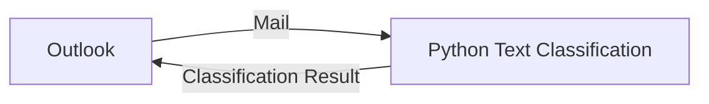
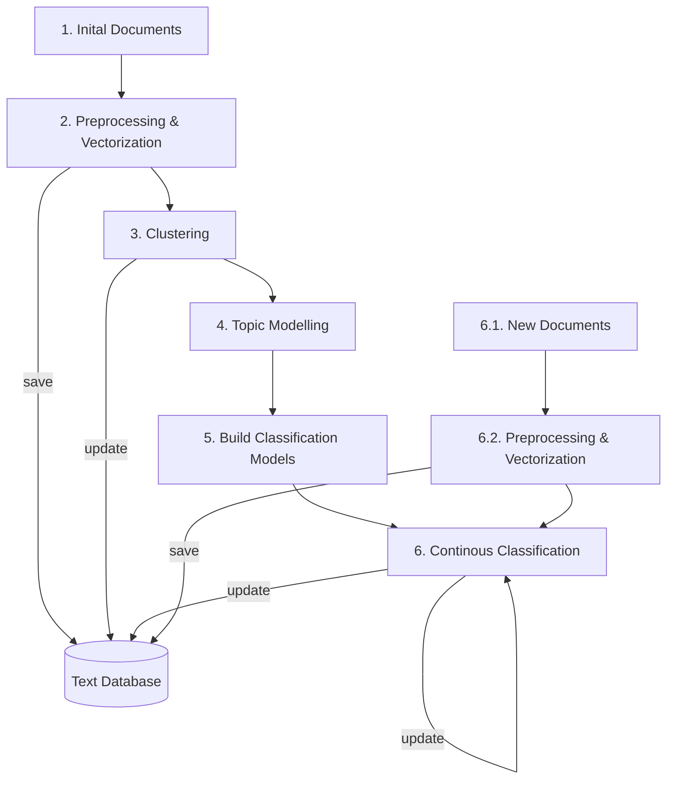

# NLP Mail Classification

This repository contains an e-mail clustering and classification

## Software Design

The NLP Mail Classification consists of two parts:

- An Outlook plugin used for handling mail specific task like:
  - Communicate with the Python API
  - Move mails to directory
  - Tag mails

- A Python API used for text clustering and text classification:
  - Initialize text data base
  - Cluster texts
  - Topic modeling on clusters
  - Classify text

## General Process

### Database Initialization

The first step is to set up a text/mail database. This is required to perform further clustering, topic modelling and classification tasks. To set up the database, all mails from the current Outlook inbox (and optional other folders) have to be exported and loaded into the Python Text Classification API. 

### Initial Clustering

The second step is the initial clustering where unsupervised algorithms are used to organize the mails into several clusters.

### Topic Modeling

In the third step, topic modelling is used to generate class names for the different clusters. These can be used for example for folder naming.

### Build Classification Models

After the initial clustering step, the cluster models will be discarded and replaced by classification models. The classification models will be trained on the initial cluster results. This is required, so that the user can in the next step modify the clustering results, create own classes and move mails/datapoints between classes. 

### Continous Classification

Since a mailbox, as most other document systems, is a live system, it is required to constantly re-train the model, especially when new classes get created by the user or a mails is wrongly classified. 

## Python Text Classification API

See [API.md](API.md) for a full list of API functions.

## Getting Started

These instructions will give you a copy of the project up and running on
your local machine for development and testing purposes. See deployment
for notes on deploying the project on a live system.

### Prerequisites

To be continued...
- Python (v.?)
- Outlook (v.?)

### Installing

To be continued...

## Running the tests

To be continued...

### Unit Tests

- To be continued...

### Style test

- Style Cop for .NET

### Deployment

To be continued...

## Built With

Open Source Software used:

- Spacy, Numpy etc...

## Contributing

Please read [CONTRIBUTING.md](CONTRIBUTING.md) for details on our code
of conduct, and the process for submitting pull requests to us.

## Versioning

To be continued...

## Authors

  - **Justus-Jonas Erker** - *What we did...* - (Justus-Jonas Erker)[https://github.com/Justus-Jonas]
  - **Merlin Köhler** - *What we did...* -
    [MerlinKoehler](https://github.com/MerlinKoehler)

## License

This project is licensed under the [MIT-License](LICENSE.md) - see the [LICENSE.md](LICENSE.md) file for
details.

## Acknowledgments

  - To be continued